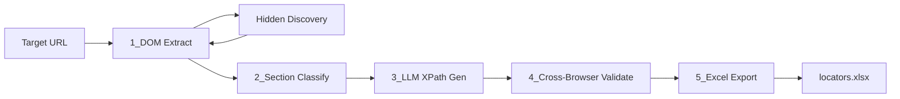

# XPath Auto Generator

LLM-powered XPath auto generator using Playwright. Point it at any URL and it extracts interactive DOM elements, names them, generates stable XPath locators, validates them across Chromium/Firefox/WebKit, and exports everything to Excel.

## Features

- **5-stage pipeline**: headless DOM extraction → section classification → LLM XPath generation → cross-browser validation → Excel export
- **Hidden-element discovery**: programmatic scroll, hover, expand, and safe form interactions capture ~30% more testable elements than static DOM analysis
- **100+ elements per page** with 90%+ first-pass cross-browser validation
- **Web UI** with live SSE progress and one-click Excel download
- **Reduces manual locator writing** from 2–3 hours per page to under 5 minutes

## Quick Start

### Prerequisites

- Python 3.11+
- OpenAI API key (recommended for best XPath quality)

### Install

```bash
cd xpath-auto-generator
python -m venv .venv
source .venv/bin/activate   # Windows: .venv\Scripts\activate
pip install -e ".[dev]"
playwright install chromium firefox webkit
```

### Configure

```bash
cp .env.example .env
# Edit .env and set OPENAI_API_KEY=sk-...
```

### Run

```bash
uvicorn xpath_gen.web.app:app --reload --port 8000
```

Open [http://localhost:8000](http://localhost:8000), enter a URL, and click **Generate Locators**.

## Usage

1. Enter the target page URL (must be `http://` or `https://`).
2. Toggle **hidden-element discovery** to enable scroll/hover/expand interactions.
3. Set max elements (default 200) and select browsers for validation.
4. Watch the live pipeline log as each stage runs.
5. Download the Excel report when complete.

### Output

The Excel workbook contains two sheets:

**Locators** — one row per element with Element Name, Section, Tag, Text, XPath, Confidence, per-browser PASS/FAIL, Overall status, Discovery Source, and Notes.

**Summary** — URL, timestamp, total elements, pass rate, static vs discovered element counts, discovery boost %, and section breakdown.

## Pipeline Architecture



| Stage | Description |
|-------|-------------|
| 1. DOM Extract | Playwright loads the page and extracts interactive elements (links, buttons, inputs, ARIA roles) |
| 2. Section Classify | Heuristic landmark detection + OpenAI batch classification into Header, Nav, Main, Form, etc. |
| 3. XPath Generate | OpenAI generates PascalCase names and absolute XPaths prioritizing id, data-testid, aria-label |
| 4. Validate | Each XPath tested in Chromium, Firefox, and WebKit; failed locators get one LLM repair attempt |
| 5. Export | Color-coded Excel with per-browser results and summary statistics |

## Configuration

| Variable | Default | Description |
|----------|---------|-------------|
| `OPENAI_API_KEY` | — | OpenAI API key for classification and XPath generation |
| `OPENAI_MODEL` | `gpt-4o` | Model for structured LLM calls |
| `PAGE_TIMEOUT_MS` | `30000` | Page load timeout in milliseconds |
| `MAX_ELEMENTS` | `200` | Maximum elements to process per page |
| `ENABLE_HIDDEN_DISCOVERY` | `true` | Enable interaction-based element discovery |
| `LLM_BATCH_SIZE_CLASSIFY` | `25` | Elements per classification batch |
| `LLM_BATCH_SIZE_GENERATE` | `15` | Elements per XPath generation batch |
| `OUTPUT_DIR` | `output` | Directory for generated Excel files |

## Development

```bash
# Run unit tests
pytest

# Run integration test (requires Playwright browsers + network)
pytest -m integration
```

## Project Structure

```
src/xpath_gen/
├── pipeline/       # 5-stage pipeline (extract, classify, generate, validate, export)
├── discovery/    # Hidden-element discovery (scroll, hover, expand, form)
├── llm/          # OpenAI client and prompts
└── web/          # FastAPI app, templates, SSE job tracking
```

## STAR Method — Interview Narrative

**Situation:** In test automation projects, writing reliable XPath locators for complex web applications was a major bottleneck. QA engineers spent 2–3 hours per page manually inspecting the DOM, naming elements, writing locators, and validating them across browsers — a process that was slow, inconsistent, and didn't account for hidden UI revealed only by user interactions like hover menus or lazy-loaded content.

**Task:** I needed to build an end-to-end tool that could take any URL, automatically discover all testable elements (including conditionally visible ones), generate human-readable names and stable XPath locators, validate them across multiple browsers, and deliver a ready-to-use spreadsheet — reducing the entire workflow to minutes instead of hours.

**Action:** I engineered a 5-stage pipeline using Playwright for headless DOM extraction and cross-browser validation, combined with OpenAI for intelligent section classification and XPath generation. A key innovation was the hidden-element discovery module that programmatically triggers scroll, hover, accordion expand, and safe form-submit events to surface 30% more elements than static analysis alone. I built a FastAPI web UI with server-sent events for real-time progress tracking and Excel export with per-browser pass/fail coloring. The system processes 100+ elements per page in batched LLM calls with automatic XPath repair on validation failures.

**Result:** The tool reduced manual locator authoring from 2–3 hours per page to under 5 minutes, achieved a 90%+ first-pass cross-browser validation rate, and captured significantly more testable elements through interaction-based discovery. The Excel output gave QA teams a immediately actionable locator library organized by page section, with confidence scores and validation status — turning a tedious manual process into a one-click automated workflow.

## License

MIT
